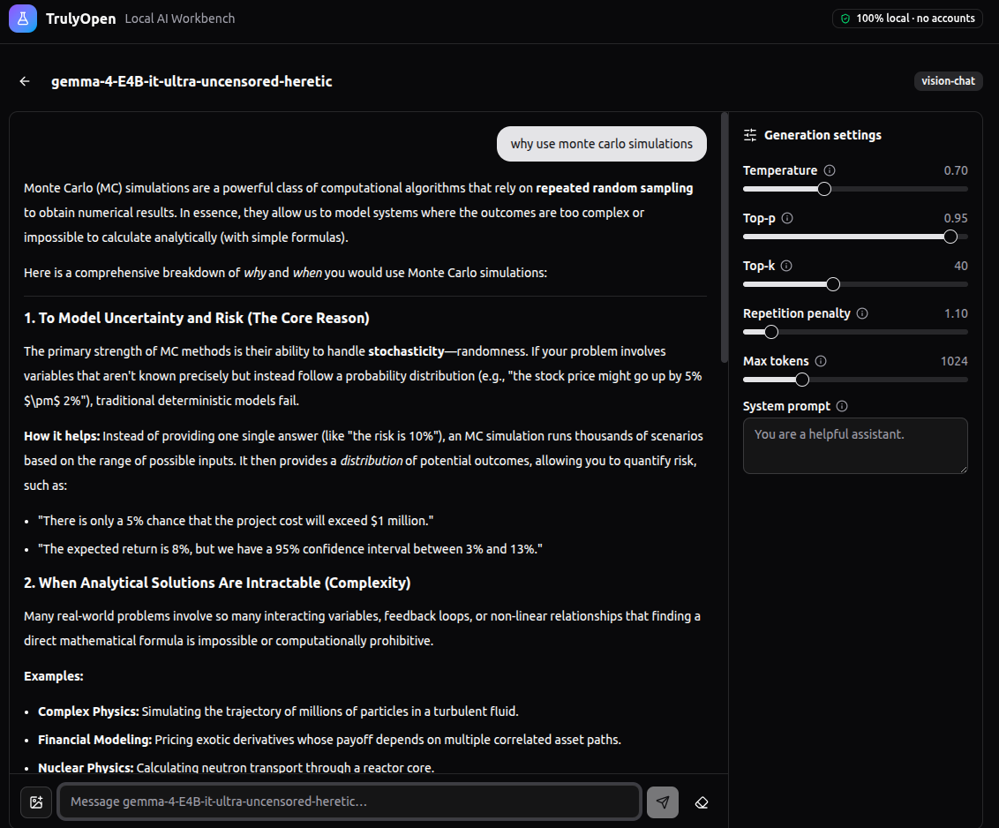
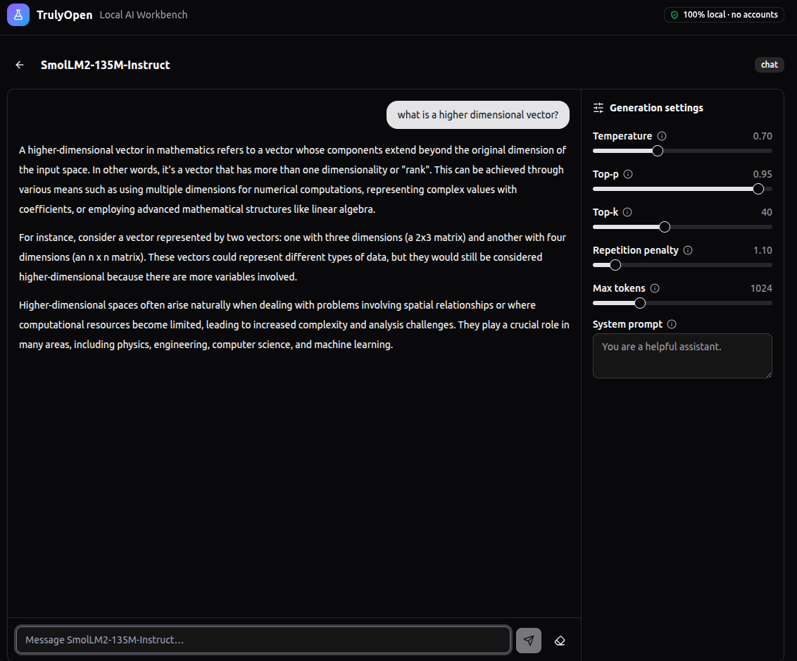

# TrulyOpen — Local AI Workbench

TrulyOpen turns your own machine into a private AI workbench. Paste any Hugging Face repo id, get an instant compatibility check against your RAM, VRAM and disk, download the model with pause/resume, then chat with text or vision models — or generate images — entirely on localhost. No accounts, no API keys, no telemetry: the only network traffic is public, unauthenticated calls to the Hugging Face API.

## Features

- **Paste-and-go model resolution** — accepts a bare `owner/name` repo id or a full `https://huggingface.co/...` URL and inspects the repository's files, size and pipeline tag.
- **Honest compatibility verdicts** — before you download anything, TrulyOpen probes your RAM, free disk and GPU VRAM and tells you whether the model fits, will run slowly on CPU, or simply will not fit.
- **GGUF quantisation picker** — for GGUF repositories, choose exactly which quantisation to download (the smallest is preselected) instead of pulling the whole repo.
- **Resumable download manager** — threaded downloads with live speed and ETA, pause/resume/cancel, and paused jobs that survive a server restart.
- **Local model library** — every completed download lands in a persistent library with one-click load, unload and delete (with the exact bytes to be freed shown before you confirm).
- **Chat playground** — streamed token-by-token responses over SSE, Markdown rendering with syntax-highlighted code blocks, a Stop button mid-generation, and image attachments for vision models.
- **Image studio** — text-to-image via Diffusers with prompt/negative prompt, dimensions, steps, guidance scale, seed control and batches of up to four images, each individually downloadable.
- **Tunable generation parameters** — temperature, top-p, top-k, repetition penalty, max tokens and a system prompt, each with an explanatory tooltip.
- **Hardware dashboard** — live RAM, disk and VRAM meters plus a readout of which inference backends (torch, CUDA, transformers, diffusers, llama.cpp) are available.
- **Graceful out-of-memory handling** — if a load or generation exhausts memory, the model is automatically unloaded and GPU/CPU memory freed, and the UI tells you what to try next.

Live use:


## Requirements

- **Node.js 20+** (frontend)
- **Python 3.10+** (backend)
- **NVIDIA GPU** — optional but strongly recommended for anything beyond small quantised models; everything also runs CPU-only, just slower.

## Quick start

The bundled script creates a Python virtual environment, installs the core dependencies, and launches the backend on port 8000 and the frontend dev server on port 3000:

```bash
./scripts/start.sh
```

Then open <http://localhost:3000>.

### Manual setup

**Backend**

```bash
cd backend
python3 -m venv .venv
source .venv/bin/activate
pip install -r requirements.txt
```

The API server runs without any ML libraries installed — you can browse, check compatibility and download models straight away. To actually run inference, install the heavy dependencies:

```bash
pip install -r requirements-ml.txt
```

Notes on `requirements-ml.txt`:

- **CPU-only machines**: install the CPU build of PyTorch first, then the rest:

  ```bash
  pip install torch --index-url https://download.pytorch.org/whl/cpu
  pip install -r requirements-ml.txt
  ```

- **NVIDIA GPUs with GGUF models**: `llama-cpp-python` ships as a CPU build by default. For CUDA acceleration, build it with:

  ```bash
  CMAKE_ARGS="-DGGML_CUDA=on" pip install --force-reinstall --no-cache-dir llama-cpp-python
  ```

Start the server:

```bash
cd backend
uvicorn app.main:app --port 8000
```

**Frontend**

```bash
cd frontend
npm install
npm run dev
```

Open <http://localhost:3000>. The dev server proxies `/api` requests to the backend on port 8000.

## Production mode

Build the frontend once and the backend will serve it directly:

```bash
cd frontend
npm run build
```

The backend detects `frontend/dist` on startup and serves it at <http://localhost:8000> — a single process, no dev server needed.

## Usage walkthrough

1. **Search** — paste a repo id (e.g. `Qwen/Qwen2.5-0.5B-Instruct-GGUF`) into the search bar on the dashboard and press Enter.
2. **Read the verdict** — the compatibility card shows the model's format, modality, size and file count, plus a colour-coded verdict:
   - **OK** (green): the estimated memory requirement fits within your largest GPU's VRAM.
   - **Warning** (amber): it will not fit in VRAM but fits in system RAM — it will run with CPU offload, which is noticeably slower.
   - **Insufficient** (red): it exceeds your RAM, or you lack the free disk space to download it. The Download button is disabled when disk space is the problem.
3. **Pick a quantisation** — for GGUF repositories, a quant picker lists every `.gguf` file with its size; the verdict updates for whichever you select.
4. **Download** — the download manager shows a progress bar, live speed and ETA per job, with pause, resume and cancel buttons. Cancelling deletes partial files; pausing keeps them so you can resume later, even after a restart.
5. **Manage your library** — completed downloads appear in the library. Load a model into memory, open it in the playground, or delete it (a confirmation dialogue states exactly how much space will be freed).
6. **Generate** — the playground adapts to the model's modality: a chat panel for text and vision models (with an image-attach button for vision), or the image studio for text-to-image models.
7. **Tune** — the parameters sidebar (collapsible on desktop, a slide-over panel on mobile) exposes sampling controls for text models and dimensions/steps/guidance/seed for image models.

## Supported model formats

| Format | Runtime | How it is detected | Example repo ids |
|---|---|---|---|
| GGUF | llama.cpp (`llama-cpp-python`) | Any `*.gguf` file in the repo (split multi-part shards are grouped) | `Qwen/Qwen2.5-0.5B-Instruct-GGUF` |
| Transformers | 🤗 Transformers (safetensors) | `config.json` plus `*.safetensors` or `*.bin` weights | `Qwen/Qwen2.5-1.5B-Instruct`, `HuggingFaceTB/SmolVLM-256M-Instruct` |
| Diffusers | 🤗 Diffusers text-to-image pipelines | `model_index.json` in the repo | `stabilityai/stable-diffusion-2-1`, `segmind/tiny-sd` |
| PEFT / LoRA | 🤗 PEFT adapter applied over a base model | `adapter_config.json` plus `adapter_model.*` weights | any LoRA adapter with an ungated base |

Modalities are derived from the repository's pipeline tag: `text-generation` and similar map to chat; `image-text-to-text`, `visual-question-answering` and `any-to-any` map to vision chat; and `text-to-image` maps to image generation. When a repository has no usable pipeline tag, TrulyOpen falls back to reading the model's `config.json` architecture (a `vision_config` implies vision chat, a causal/seq2seq architecture implies chat) so that mistagged or lightly-documented models are still classified correctly.

**LoRA / PEFT adapters** are not standalone models — they are a small set of weights applied on top of a base model. TrulyOpen reads the adapter's base model from its `adapter_config.json`; when you load the adapter it uses that base model from your local library if you have it, otherwise it downloads the base from Hugging Face. If the base is gated or private (many Gemma and Llama bases are), download an ungated base into your library first, then load the adapter.

**Custom architectures.** Transformers, Diffusers and PEFT models are loaded with `trust_remote_code=True`, so models that ship their own modelling code (via `auto_map` in `config.json`) will load. This executes code from the model repository on your machine — only download models from sources you trust.

**Quantised models.** SDNQ (SD.Next Quantization, `quant_method: "sdnq"`) is supported via the `sdnq` package — importing it registers with Transformers/Diffusers, so SDNQ-quantised chat and image models (e.g. `Disty0/Z-Image-Turbo-SDNQ-uint4-svd-r32`) load transparently and run on CPU or GPU. Other quantisations that Transformers understands (bitsandbytes, GPTQ, AWQ) work when their library is installed and, for most, a CUDA GPU is present; if the required library is missing the model fails to load with a clear message rather than crashing.

**Text-to-image components.** A repository tagged `text-to-image` that is *not* a complete Diffusers pipeline (no `model_index.json`) — for example a standalone quantised text encoder such as `…-Z-Image-Turbo-TE-…` — cannot generate images on its own and is reported as unsupported. Download the full pipeline repository instead.

**What cannot run.** Some formats need an entirely different runtime and are reported as unsupported with an explanation rather than downloaded blindly: on-device LiteRT/MediaPipe models (`.litertlm`, `.tflite`), Core ML models (`.mlmodel`), ONNX-only repositories, and bespoke research architectures that ship raw `.pth` checkpoints with a private training library. These are genuinely outside a PyTorch/GGUF/Diffusers workbench.

## Configuration

All configuration is via environment variables — no config files, no accounts.

| Variable | Applies to | Default | Purpose |
|---|---|---|---|
| `WORKBENCH_DATA_DIR` | backend | `backend/data` | Root directory for the registry and download state |
| `WORKBENCH_MODELS_DIR` | backend | `<data dir>/models` | Where downloaded model files are stored |
| `WORKBENCH_CORS_ORIGINS` | backend | *(empty)* | Comma-separated extra CORS origins, in addition to `http://localhost:3000` |
| `VITE_API_BASE` | frontend | *(empty)* | Base URL prefixed to every API request; leave empty for local use |

## Remote deployment

The frontend is a static Vite build and deploys happily to Vercel — set `VITE_API_BASE` at build time to point at a backend hosted elsewhere (e.g. Render), and add that frontend's origin to the backend's `WORKBENCH_CORS_ORIGINS`. Be realistic about the backend, though: model downloads need generous disk, and inference beyond small quantised models genuinely needs a GPU machine. A CPU-only free tier will serve the API and downloads fine but will crawl through generation.

## Troubleshooting

- **HTTP 507 / out of memory** — the model has already been unloaded and GPU/CPU memory freed automatically. Try a smaller model or quantisation, lower max tokens, or smaller image dimensions.
- **"This repository is gated"** — TrulyOpen is deliberately zero-auth and cannot accept Hugging Face tokens, so gated repositories (e.g. some Llama and Stable Diffusion releases) are not supported. Pick an open alternative.
- **"pip install -r requirements-ml.txt" errors when loading a model** — the API runs without ML libraries, but inference needs them; install the ML requirements into the backend's virtual environment (see the notes above for CPU-only torch and CUDA llama.cpp builds).
- **Port conflicts** — the backend expects 8000 and the frontend dev server 3000. Free those ports, or run uvicorn on another port and point the frontend at it via `VITE_API_BASE`.
- **"Cannot reach the local backend"** — the backend is not running or is on a different port; start it with `uvicorn app.main:app --port 8000` from `backend/`.
- **GGUF models ignore the GPU** — reinstall `llama-cpp-python` with the CUDA build flags shown above; the default wheel is CPU-only.

## Architecture

The full module contract to be shared in [docs/ARCHITECTURE.md](docs/ARCHITECTURE.md).



## Privacy

Everything runs on your machine. Model weights, chat history, generated images and settings never leave localhost; the only outbound traffic is public, unauthenticated requests to the Hugging Face API for repository metadata and file downloads.

## License
MIT 2026